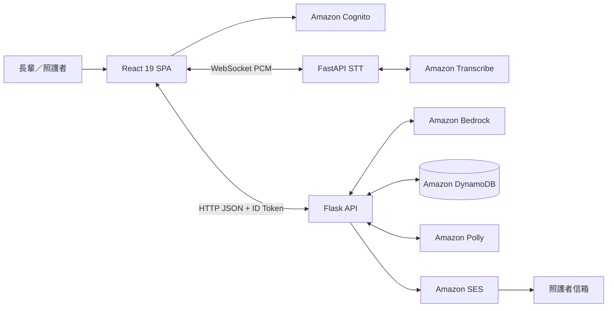

# 設計文件：智慧長照陪伴系統

## 文件資訊

- 規格名稱：`elder-ai-companion-project-plan`
- 工作流程：Kiro Requirements First
- 文件性質：依現有專案反向整理的系統設計基線
- 對應需求：`requirements.md` Requirement 1–14
- 設計限制：遵循 `.kiro/steering/架構鎖定規格.md`，不變更既有技術組成、API 格式與資料模型

## 1. 設計目標

本系統以「語音優先的 AI 陪伴」與「經授權的照護資訊共享」為核心。長輩可用語音或文字與 AI 助手互動，系統從對話中整理生活記憶，並讓已核准照護者查看健康總覽、摘要與通知。系統不是醫療診斷或緊急救援工具。

設計原則：

1. 長輩操作簡單，語音服務失敗時仍可使用文字或瀏覽器語音能力。
2. Bedrock 只產生回覆與記憶操作指令，資料寫入由 Python 驗證後執行。
3. 所有他人資料存取都必須通過本人或 approved 追蹤關係檢查。
4. 現有 React、Flask、FastAPI STT 與 AWS 服務分工保持不變。
5. 使用繁體中文、臺灣時間與可追溯的衛教資料來源。

## 2. 系統架構

完整語音鏈固定為：

`麥克風 → React → STT Service → Transcribe → React → Flask → Bedrock → Flask → Polly → React 播放`

STT Service 僅負責語音轉文字；所有模型請求、記憶處理、資料存取及 Polly 語音合成都由 Flask 統一協調。

## 3. 元件設計

### 3.1 React 前端

職責：

- 執行 Cognito 登入、儲存 `id_token` 並依角色分流。
- 提供長輩聊天、語音錄製、記憶卡、個人資料及追蹤請求介面。
- 提供照護者追蹤清單、健康總覽、摘要、排程與通知鈴鐺。
- 使用原生 `fetch` 呼叫 Flask API。
- 以 WebSocket 傳送 Int16 PCM 至 STT Service。
- 播放 Flask 回傳的 base64 mp3；失敗時使用 `speechSynthesis`。

### 3.2 Flask 主後端

職責：

- 以 Blueprint 提供 auth、chat、profile、follow、summary、health-overview 與 care-items API。
- 驗證 Cognito JWT，將 `sub` 設為 `g.user_id`。
- 協調 Bedrock 雙呼叫、記憶操作、DynamoDB、Polly 與 SES。
- 執行本人／核准追蹤者權限檢查。
- 啟動應用內摘要排程器，每 60 秒檢查到期排程。

### 3.3 FastAPI STT Service

職責：

- 接收 React 傳送的 16 kHz、mono、PCM Int16 binary 音訊。
- 串接 Transcribe Streaming `zh-TW`。
- 回傳 `partial`、`final` 或 `fallback` JSON 事件。
- 不直接呼叫 Flask、Bedrock、DynamoDB 或 Polly。

### 3.4 Bedrock 服務

所有模型呼叫統一經 `invoke_bedrock(system_prompt, user_message, max_tokens)`：

- Call #1：根據個人資料、記憶卡與知識庫內容產生陪伴回覆。
- Call #2：產生 `add`／`update` 記憶操作 JSON。
- 摘要：產生每日摘要、每週摘要與跨日洞察文字。

模型不得直接寫入 DynamoDB。

### 3.5 知識庫服務

- 掃描 HealthKnowledgeBase。
- 以關鍵字子字串與 regex 比對使用者訊息。
- 將命中內容、來源與網址加入 Bedrock 上下文。
- 無命中或查詢失敗時回傳空集合，不中斷聊天。

### 3.6 摘要與通知服務

- 每日摘要依臺灣日期收集當日 Facts，分類後交由 Bedrock 彙整。
- 每週摘要由既有 daily summaries 歸納。
- 排程器讀取 approved Follows 的設定時間，到點後產生摘要。
- 摘要完成後由 SES 向照護者寄信；寄送失敗不回滾摘要。
- React 輪詢摘要並以日期與內容 fingerprint 管理站內通知已讀狀態。

## 4. 主要資料流

### 4.1 認證

1. React 取得 Cognito Hosted UI URL。
2. Cognito callback 將 authorization code 交給 Flask。
3. Flask 交換 token、驗證 RS256 JWT，首次登入時建立 Accounts。
4. React 將 `id_token` 儲存於 localStorage，受保護 API 以 Bearer Token 傳送。

### 4.2 AI 語音陪伴

1. React 錄製音訊並透過 WebSocket 傳給 STT Service。
2. STT Service 透過 Transcribe 回傳最終辨識文字。
3. React 以 `POST /api/chat/send` 將文字送給 Flask。
4. Flask 讀取 profile、Facts 與知識庫命中內容。
5. Flask 呼叫 Bedrock Call #1 產生回覆，Call #2 產生記憶操作。
6. Python 驗證操作後更新 Facts／FactHistory，並儲存 Messages。
7. Flask 呼叫 Polly 產生 mp3，將 base64 音訊與回覆一併傳回 React。

### 4.3 追蹤與健康總覽

1. 照護者以 account handle 與六位數綁定碼提出 pending 請求。
2. 長輩核准後狀態改為 approved。
3. 健康總覽、摘要與排程 API 驗證呼叫者為本人或 approved 追蹤者。
4. 未授權請求回傳 HTTP 403。

### 4.4 每日摘要通知

1. 照護者設定 `HH:MM` 臺灣時間。
2. 排程器每 60 秒掃描已核准且已設定時間的 Follows。
3. 到點且摘要尚不存在時，讀取 Facts、呼叫 Bedrock 並寫入 DailySummaries。
4. 由 Cognito 查詢照護者 email，透過 SES 寄送摘要。
5. React 偵測新摘要後顯示通知，點擊後導向指定摘要日期。

## 5. API 與介面約定

- 前後端：HTTP + JSON，`Content-Type: application/json`。
- 認證：`Authorization: Bearer <id_token>`。
- 錯誤：`{"error":"訊息"}` 搭配適當 HTTP status。
- 聊天輸入：`{"message":"...","session_id":"uuid 或 null"}`。
- 聊天輸出：`session_id`、`response`、`audio`、`memory_updates`。
- WebSocket STT：binary PCM 輸入；`partial`／`final`／`fallback` JSON 輸出。
- 時間：後端產生 UTC+8 ISO 8601；排程使用 `HH:MM`。

## 6. 資料模型

| 資料表 | 主鍵 | 用途 |
|---|---|---|
| Accounts | `account_id` | Cognito 身分、角色、個資、同意與互動次數 |
| Facts | `fact_id` | 目前有效的生活／健康記憶卡 |
| FactHistory | `history_id` | 記憶卡更新前內容 |
| Sessions | `session_id` | 對話工作階段 |
| Messages | `message_id` | 使用者與 AI 訊息 |
| Follows | `follow_id` | 追蹤關係、核准狀態與摘要排程 |
| DailySummaries | `account_id#date` | 每日與每週摘要 |
| HealthKnowledgeBase | `topic_id` | 衛教知識、關鍵字與來源 |

全部資料表採 PAY_PER_REQUEST。Accounts 的慢性病、用藥與過敏欄位維持 JSON 字串；Facts 更新與 FactHistory 寫入使用同一 transaction。

## 7. 安全與隱私

- Account ID 一律取自已驗證 JWT 的 `sub`，不得信任 request body 傳入身分。
- 目標帳號 API 必須檢查本人或 approved Follows。
- Call #2 category 使用白名單，update ID 必須存在於目前使用者 Facts。
- AWS 憑證、Cognito、模型 ID、SES sender 與服務 URL置於環境變數。
- 健康內容定位為衛教與生活陪伴，不提供診斷、治療或緊急救援。

## 8. 錯誤處理與降級

| 失敗情境 | 處理方式 |
|---|---|
| Transcribe 不可用 | STT 回傳 fallback，React 改用 Web Speech API |
| Polly 不可用 | 回傳空 audio，React 使用 speechSynthesis |
| Bedrock 失敗 | API 回傳錯誤，不寫入不完整記憶 |
| Call #2 JSON 無效 | 記錄警告並忽略全部記憶操作 |
| 知識庫查詢失敗 | 使用空知識上下文繼續聊天 |
| SES 寄送失敗 | 保留摘要並記錄錯誤 |
| 未授權資料存取 | 回傳 401 或 403，不洩漏目標資料 |
| 排程單一帳號失敗 | 記錄錯誤並繼續處理其他帳號 |

## 9. 驗證策略

- 認證：登入 callback、JWT 正反向案例、首次建帳。
- 語音：PCM 格式、partial/final、fallback、完整 Flask/Bedrock/Polly 鏈。
- 聊天：四個 response keys、Bedrock 雙呼叫、Messages 寫入。
- 記憶：category 白名單、track 預設、幻覺 ID、transaction。
- 權限：本人、approved、pending、未綁定使用者。
- 摘要：無 Facts、每日、每週、重複觸發、停機後補跑。
- 通知：SES sandbox、寄送失敗、站內已讀與日期跳轉。
- 建置：前端 build、Python import/compile、三服務 smoke test。

## 10. 已知限制與待確認事項

- SES sandbox 僅能寄送至已驗證地址。
- 排程器依賴 Flask 進程持續運行。
- DynamoDB scan 有 1 MB 與分頁限制。
- 知識庫為關鍵字／regex，不具語意向量搜尋。
- 跨日洞察前端入口目前停用。
- `daily_summary_time`、額外 Facts 欄位及健康總覽額外分類與鎖定規格存在差異。
- Call #2 非同步現況與鎖定的同步順序存在差異，實作調整前必須先確認。

## 11. 需求追蹤

| 設計區域 | 對應需求 |
|---|---|
| 角色、同意、認證 | R1–R3 |
| 語音與 AI 對話 | R4–R5 |
| 記憶與知識庫 | R6–R7 |
| 追蹤與健康總覽 | R8–R9 |
| 摘要與通知 | R10–R11 |
| DynamoDB | R12 |
| 非功能與降級 | R13 |
| 限制與治理 | R14 |
