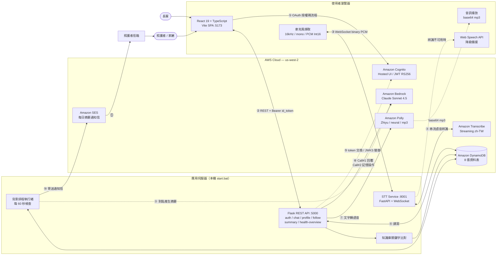

# 系統架構圖

本目錄提供兩種格式：

| 檔案 | 用途 |
|------|------|
| `系統架構圖.drawio` | **含 AWS 官方圖標**，用於報告與投影片，可匯出 PNG / SVG / PDF |
| 本文件的 Mermaid 圖 | 純文字版，可在編輯器或 GitHub 直接預覽，方便隨程式碼一起維護 |

---

## 一、開啟與匯出 `.drawio`

`.drawio` 使用 draw.io 內建的 **AWS 2019（aws4）** 圖標庫，圖標即為 AWS 官方素材。

**開啟方式（任一種）**

1. 瀏覽器開 <https://app.diagrams.net> → File → Open from → Device → 選擇 `docs/系統架構圖.drawio`
2. 在 Kiro / VS Code 安裝 **Draw.io Integration** 擴充套件後，直接點開該檔案即可編輯
3. 安裝 draw.io Desktop 應用程式後雙擊開啟

**匯出給報告用**

File → Export as → PNG（建議勾選 Transparent Background、Zoom 200% 以取得高解析度）或 SVG（向量，投影片放大不失真）。

---

## 二、架構總覽（Mermaid）

---

## 三、主要流程說明

### 登入（①⑤）

前端取得 Cognito Hosted UI 網址後導向登入，Cognito 以授權碼回呼後端；後端向 token 端點交換 token，並以 JWKS 公鑰驗證 `id_token` 簽章、audience 與 issuer。使用者身分一律取自 JWT 的 `sub`，不採用請求內容帶入的 `account_id`。

### 語音輸入（③④）

瀏覽器以 16 kHz、單聲道擷取音訊，轉為 Int16 PCM 後以 **WebSocket binary** 傳送（不經 base64），由獨立的 STT 服務轉送至 Transcribe 串流辨識，回傳 `partial` / `final` 事件。Transcribe 不可用時改用瀏覽器的 Web Speech API。

### 對話與記憶（⑥⑧）

每輪對話對 Bedrock 進行**兩次獨立呼叫**：第一次生成回覆文字，第二次產出記憶操作的 JSON 指令。LLM 只輸出指令，**實際寫入一律由 Python 執行**，並經過類別白名單、防幻覺 ID 檢查等守門規則；`Facts` 的更新與 `FactHistory` 的寫入在同一筆交易內完成。

### 語音輸出（⑦）

回覆文字送入 Polly 合成 mp3，以 base64 內嵌於 JSON 回傳，前端以 `data:audio/mp3;base64,...` 播放。

### 每日摘要與通知（⑨⑩⑪）

照護者可設定推播時間，記錄於 `Follows`。背景執行緒每 60 秒檢查，條件為「已過設定時間**且**當天尚無摘要」——此設計使伺服器停機後重啟能自動補跑，且天然避免重複產生。摘要產生後透過 SES 寄送通知信，收件地址以使用者 `sub` 向 Cognito 反查，不在資料庫另存 email。

---

## 四、設計取捨

| 項目 | 選擇 | 原因 |
|------|------|------|
| 語音架構 | Transcribe → Bedrock → Polly 三段式 | 各段可獨立替換與除錯，不採用 Speech-to-Speech |
| 記憶寫入 | LLM 產出 JSON，Python 執行寫入 | LLM 不直接接觸資料庫，可加入驗證與交易保證 |
| 音訊傳輸 | base64 內嵌 JSON | 省去物件儲存與簽章網址，單一往返即可播放 |
| 排程 | 應用伺服器內背景執行緒 | 避免引入部署流程；替換為 EventBridge + Lambda 的規劃見下 |
| 知識庫檢索 | 關鍵字 / regex 比對 | 命中原因可追溯，符合醫療衛教情境的可解釋性要求 |
| 資料隔離 | 全部查詢以 `account_id` 為條件 | 權限檢查集中於「本人或已核准追蹤者」 |

上線時的調整方向（含 SES 沙箱、排程改用 EventBridge + Lambda、`query` 取代 `scan` 等）詳見 `技術限制與未來規劃.md`。
